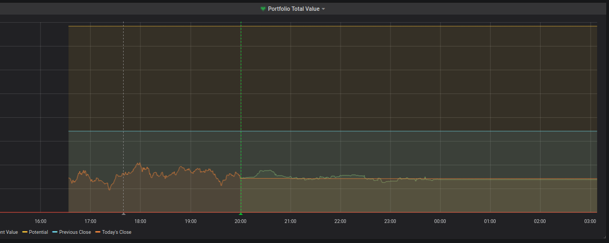

### Robinhood trader and monitor

As I've recently taken an interest in trading on Robinhood in light of the Pandemic, I've started working on a simple
trading platform (based on `pyrh`) to make transactions and collect data in influxdb for monitoring on a Grafana dashboard.

#### Current state

This project can monitor Robinhood. I hope to add trading at some point in the near-future.

